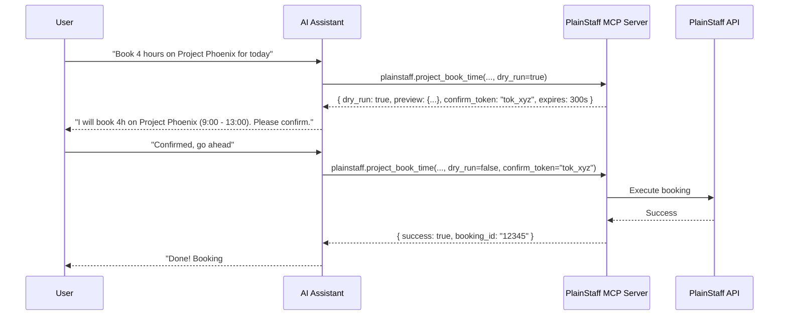

<div align="center">

# PlainStaff Model Context Protocol (MCP) Server

**Secure, enterprise-grade AI assistant integration for PlainStaff time tracking, projects, absences, and workforce management.**

[](https://www.npmjs.com/package/@plainstaff/mcp)
[](https://opensource.org/licenses/MIT)
[](https://nodejs.org)
[](https://modelcontextprotocol.io/)
[](https://github.com/P1ainStaff/MCP/actions)

[Quick Start](#-quick-start) • [Client Setup](#-client-configuration) • [Available Tools](#-tool-catalog) • [Two-Phase Safety](#-safety--two-phase-write-confirmation) • [Development](#-development)

</div>

---

> [!WARNING]
> **Under Active Development — Not Yet Live**  
> The PlainStaff MCP extension is currently in active development and **cannot be used yet**. The remote endpoints and published packages are not yet live.

---

## 🌟 Overview

The **PlainStaff MCP Server** connects AI assistants—including **Claude** (Desktop & Code), **ChatGPT**, **Cursor**, **Grok**, and custom LLM agents—directly to your [PlainStaff](https://plainstaff.com) workspace. 

Through standard [Model Context Protocol (MCP)](https://modelcontextprotocol.io) interfaces, LLMs can inspect working hours, manage project bookings, check vacation balances, evaluate shift plans, and generate reports—while strictly honoring company permissions and employee privacy.

### Core Highlights

- 🛡️ **Two-Phase Write Confirmation:** Destructive and write operations run in `dry_run` preview mode by default. Assisting agents must receive explicit user approval and commit with a timed `confirm_token`.
- 🔒 **Enterprise-Grade Security:** Strict multi-tenant isolation, RBAC role checks (Employee, Manager, HR Admin), and OAuth 2.1 Bearer authentication.
- ⚡ **Dual Transport Architecture:**
  - **Remote HTTP (`POST /mcp`):** Stateless streamable JSON endpoint for cloud assistants (ChatGPT, Claude Connectors, Grok).
  - **Local stdio Proxy (`plainstaff-mcp-server`):** Zero-latency stdio-to-HTTPS proxy for desktop apps and IDEs.
- 📊 **26+ Curated Tools:** Covering time tracking, project financials, employee master data, shifts, and ArbZG compliance.
- 💡 **Built-in Prompts & Resources:** Out-of-the-box workflows for month-end reviews (`monatsabschluss`), project status audits (`projektstatus`), and live schema introspection.

---

## 🚀 Quick Start

### Local stdio Proxy (Desktop & IDEs)

No local installation required—run directly via `npx`:

```bash
# Using an OAuth Bearer Token
export PLAINSTAFF_ACCESS_TOKEN="your_access_token"

# Or using your Personal API Key
export PLAINSTAFF_API_KEY="your_api_key"
export PLAINSTAFF_TENANT="your_tenant_id"

npx -y @plainstaff/mcp
```

### Remote HTTP Endpoint (Cloud Assistants)

For cloud connectors (Claude custom connector, ChatGPT Apps SDK, Grok):

```http
POST https://api.plainstaff.com/mcp
Authorization: Bearer <oauth2_access_token>
Content-Type: application/json
```

OAuth 2.1 discovery endpoints:
- Authorization Server: `GET /.well-known/oauth-authorization-server`
- Protected Resource: `GET /.well-known/oauth-protected-resource`

---

## 💻 Client Configuration

### Claude Desktop

Add to your `claude_desktop_config.json` (`~/Library/Application Support/Claude/claude_desktop_config.json` on macOS):

```json
{
  "mcpServers": {
    "plainstaff": {
      "command": "npx",
      "args": ["-y", "@plainstaff/mcp"],
      "env": {
        "PLAINSTAFF_ACCESS_TOKEN": "your_access_token"
      }
    }
  }
}
```

### Cursor / VS Code

Add to `.cursor/mcp.json` in your project root or user settings:

```json
{
  "mcpServers": {
    "plainstaff": {
      "command": "npx",
      "args": ["-y", "@plainstaff/mcp"],
      "env": {
        "PLAINSTAFF_API_KEY": "your_api_key",
        "PLAINSTAFF_TENANT": "your_tenant"
      }
    }
  }
}
```

---

## 🧰 Tool Catalog

Tools are grouped by domain with fine-grained RBAC permission checks:

### ⏱️ Time Tracking & Absences
| Tool | Scope | Description |
|------|:-----:|-------------|
| `plainstaff.time_book` | Write ⚠️ | Record or update a working time entry (`dry_run` preview by default). |
| `plainstaff.time_get_bookings` | Read | Retrieve work hour bookings within a date interval. |
| `plainstaff.time_get_balance` | Read | Calculate current flextime / overtime balance and target hours. |
| `plainstaff.time_get_absences` | Read | List recorded vacations, sick leaves, and public holidays. |
| `plainstaff.time_request_absence`| Write ⚠️ | Submit an absence or vacation request. |
| `plainstaff.time_get_open_approvals`| Read | List timesheets and vacation requests awaiting managerial approval. |
| `plainstaff.time_approve` | Write ⚠️ | Approve or reject pending time bookings or absences. |
| `plainstaff.time_correct_booking` | Write ⚠️ | Submit an official time booking correction. |

### 📂 Projects & Billing
| Tool | Scope | Description |
|------|:-----:|-------------|
| `plainstaff.project_list` | Read | List active projects, customers, and assigned project budgets. |
| `plainstaff.project_get_balance` | Read | Analyze project budget consumption, burn rate, and remaining hours. |
| `plainstaff.project_get_bookings` | Read | Detailed time bookings allocated to a specific project. |
| `plainstaff.project_book_time` | Write ⚠️ | Book hours directly against a project task or milestone. |
| `plainstaff.project_get_billing_status` | Read | Retrieve invoice status and unbilled project hours. |

### 👥 Master Data & Organizations
| Tool | Scope | Description |
|------|:-----:|-------------|
| `plainstaff.employee_list` | Read | List accessible colleagues, teams, and departments. |
| `plainstaff.employee_get` | Read | Retrieve detailed profile for an employee (subject to RBAC). |
| `plainstaff.customer_list` | Read | Query customer directories linked to projects. |
| `plainstaff.team_list` | Read | List organizational units and team structures. |
| `plainstaff.region_get_holidays` | Read | Query regional public holidays and non-working days. |

### 📅 Workforce, Shifts & Compliance
| Tool | Scope | Description |
|------|:-----:|-------------|
| `plainstaff.shift_get_plan` | Read | Retrieve rostered shifts and duty rosters. |
| `plainstaff.shift_get_availability` | Read | Query employee availability considering vacations and target hours. |
| `plainstaff.compliance_check_period`| Read | Audit working hours against legal regulations (e.g. ArbZG rest breaks, max daily hours). |

### 🔍 Discovery & Reports
| Tool | Scope | Description |
|------|:-----:|-------------|
| `plainstaff.search` | Read | Fast full-text lookup across master data (employees, projects, customers). |
| `plainstaff.fetch` | Read | Retrieve a specific entity by its URI (`plainstaff://{entity}/{id}`). |
| `plainstaff.report_list_configurations` | Read | List available reporting templates. |
| `plainstaff.report_run` | Read | Execute predefined reports and export aggregated data. |

---

## 🛡️ Safety & Two-Phase Write Confirmation

To protect against inadvertent AI actions (hallucinations, accidental deletions, erroneous bookings), all write operations use **Two-Phase Commit**:



1. **Phase 1 (Preview):** The tool is called with `dry_run: true` (default). The server calculates the result, checks permissions, and issues a short-lived cryptographic `confirm_token` (valid for 5 minutes).
2. **Phase 2 (Commit):** The assistant prompts the user for verification. Upon user consent, the tool is called again with `dry_run: false` and the matching `confirm_token`.

---

## 🛠️ Development

This package is written in modern TypeScript (ESM) and uses `vitest` for contract and integration testing.

```bash
# Clone the repository
git clone https://github.com/P1ainStaff/MCP.git
cd MCP

# Install dependencies
pnpm install

# Run unit & schema tests
pnpm test

# Typecheck and build dist/
pnpm run build
```

---

## 📄 License & Links

- **License:** MIT License — see [LICENSE](LICENSE) for details.
- **PlainStaff Website:** [plainstaff.com](https://plainstaff.com)
- **Developer Documentation:** [plainstaff.com/developers/mcp](https://plainstaff.com/developers/mcp)
- **Issues & Feedback:** [GitHub Issues](https://github.com/P1ainStaff/MCP/issues)

<div align="center">
  <sub>Built with ❤️ by the <a href="https://plainstaff.com">PlainStaff</a> team.</sub>
</div>
